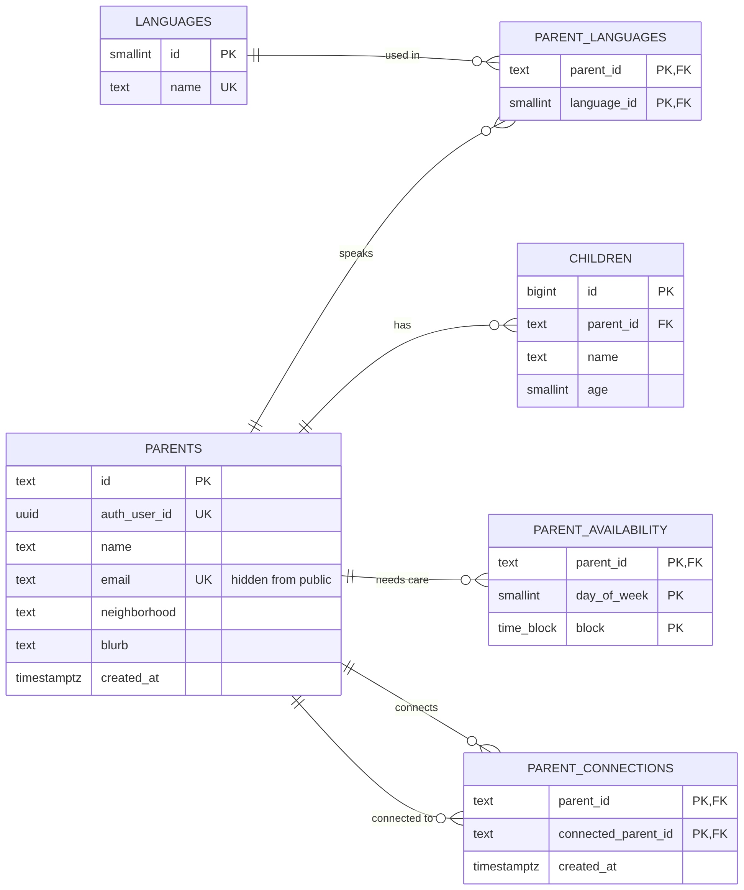
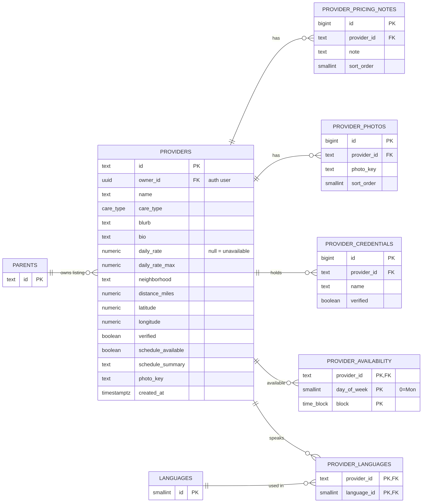
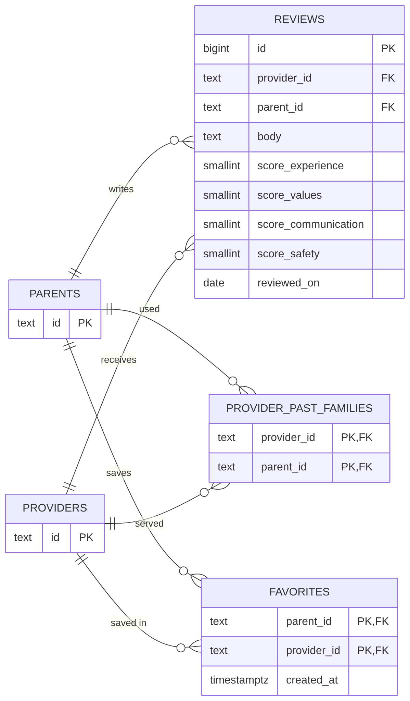
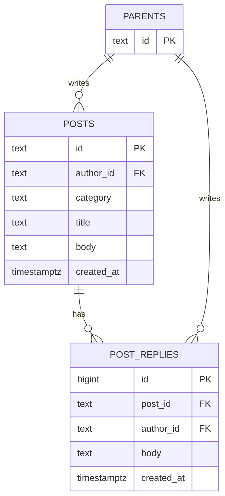
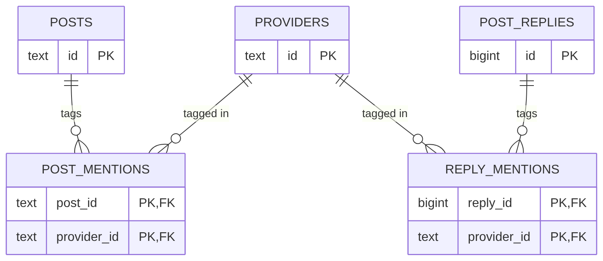

# CareConnect

**Live app:** https://pixel-perfect-magic-622.lovable.app
**Lovable project:** https://lovable.dev/projects/552dad75-fe91-4c90-bc61-ccab099dda72

## App Summary

Parents struggle to find child care that fits their family's specific needs because the options are scattered across provider websites, listings, and word-of-mouth recommendations. Every family weighs things differently: some need care that adapts to a constantly changing work schedule, some are priced out or surprised by extra fees, and some care most about trusting the people watching their children. The people who feel this most are working parents — especially shift workers, first-time parents, and bilingual households — who have to compare daycares, preschools, sitters, and family friends by hand. CareConnect puts price, schedule, and trust in one place. Parents filter providers by care type, price, distance, rating, verification, and language, and see each provider's daily cost (or a clear "pricing unavailable"). They save the hours they need care in a weekly calendar and the app shows exactly where a provider's availability overlaps or leaves gaps. Parents can read and write detailed ratings, save favorites and compare two or three side by side, connect with other parents, and ask questions on a message board, while caregivers can publish their own listing.

## ERD

Our database has 19 tables. To keep it readable, the ERD is split into five diagrams by feature. Together they show every table, every attribute, and every labeled relationship. A table drawn with only its `id` is detailed in another diagram. Click any image to open it full size.

**Key:** `PK` primary key · `FK` foreign key · `UK` unique · `||--o{` one-to-many (one on the bar side, zero-or-many on the crow's-foot side)

### 1. Parents and families
Parent profiles, their children, languages, the weekly hours they need care, and parent-to-parent connections.

<a href="docs/erd-1-parents.png"></a>

### 2. Providers
Provider listings with price, schedule, languages, photos, licenses, and the user who owns the listing.

<a href="docs/erd-2-providers.png"></a>

### 3. Trust and saving
Reviews with four detailed scores, families who have used a provider, and saved favorites.

<a href="docs/erd-3-trust.png"></a>

### 4. Message board
Posts and replies written by parents.

<a href="docs/erd-4-board.png"></a>

### 5. Provider tags on the message board
Providers tagged in posts and replies.

<a href="docs/erd-5-mentions.png"></a>

**Full diagram:** all 19 tables on one page are in [docs/erd.png](docs/erd.png) (zoom in to read). Diagram sources are the `docs/*.mmd` Mermaid files, and the SQL that builds the database is in [`supabase/setup.sql`](supabase/setup.sql).

## Tech Stack

| Layer | What we used | Why it fits our team |
| --- | --- | --- |
| Frontend | React 19, TanStack Start + TanStack Router (file-based routes in `src/routes`), Tailwind CSS | Lovable generates this stack, so we could design screens quickly with prompts and still edit the code by hand. File-based routes make it easy for each teammate to own a page. |
| Data fetching | TanStack Query + `@supabase/supabase-js` | Caches database reads and refreshes them after every save, so the UI updates instantly without us writing a backend API. |
| Database | Supabase Postgres with Row Level Security | A real relational database that matches our ERD. Security rules live in the database, so users can only change their own data. |
| Authentication | Supabase Auth (email + password) | Sign-up, login, and password reset with no extra service. New sign-ups automatically get a parent profile through a database trigger. |
| Hosting / workflow | Lovable (build + hosting), GitHub (source of truth) | Pushing to `main` syncs to Lovable and anyone on the team can publish. Everyone can work in the Lovable editor or locally in GitHub. |

## How to Get It Running

### Option A — Use the hosted app (no setup)

1. Open the live app: https://pixel-perfect-magic-622.lovable.app
2. Click **Create account**, fill in your name, email, password, children, and the weekly hours you need care, then submit.
3. If email confirmation is on, click the link in the confirmation email, then log in.
4. To edit the project, open the [Lovable project](https://lovable.dev/projects/552dad75-fe91-4c90-bc61-ccab099dda72) (ask a teammate for access). Click **Publish → Update** in Lovable to push the latest `main` to the live site.

### Option B — Run it from a fresh copy of the code

You need [Node.js](https://nodejs.org) 20+ and npm.

```sh
git clone https://github.com/IS-Junior-Core-3-5/CareConnect.git
cd CareConnect
npm install
npm run dev
```

Open the local URL that Vite prints in the terminal. The repo's `.env` already points at our Supabase project:

```
VITE_SUPABASE_URL=https://lhjzcxvyyvxdywwvjoyv.supabase.co
VITE_SUPABASE_PUBLISHABLE_KEY=sb_publishable_...
```

(The publishable key is safe to be public; Row Level Security protects the data.)

### Option C — Use your own Supabase database

1. Create a project at [supabase.com](https://supabase.com).
2. In the Supabase dashboard, open **SQL Editor → New query**, paste all of [`supabase/setup.sql`](supabase/setup.sql), and click **Run**. This creates the tables, demo data, the sign-up trigger, and the security rules.
3. In **Project Settings → API**, copy the Project URL and the publishable key into `.env` as `VITE_SUPABASE_URL` and `VITE_SUPABASE_PUBLISHABLE_KEY`.
4. In **Authentication → URL Configuration**, set **Site URL** to where the app runs (e.g. your local URL or your Lovable URL) and add it under **Redirect URLs**. For quick testing you can turn off **Confirm email** under **Authentication → Sign In / Providers → Email**.
5. Run `npm run dev`.

## Verifying the Vertical Slice

The vertical slice is the **Add to favorites** button: UI → Supabase `favorites` table → back to the UI.

1. Log in (or create an account) on the live app.
2. Click **Trusted Providers** in the top navigation.
3. On any provider card, click the empty heart **♡**.
   - The heart turns solid **♥**.
   - A "Saved to favorites" message appears.
   - The **Favorites** link in the navigation shows the new count.
4. **Refresh the page** (Ctrl/Cmd + R). The heart is still **♥** and the count is unchanged.
5. Click **Favorites** in the navigation. The provider is listed there, and is still there after another refresh.
6. To prove it is saved in the database (not just the browser), do one of these:
   - Log in with the same account in a different browser or private window. The favorite is there.
   - In Supabase, open **Table Editor → favorites**. There is a row with your parent id and that provider's id.
7. Click the heart again to remove it, then refresh. The heart stays empty and the row is gone from the table.

Other actions that also save and survive a refresh: editing your schedule (**Schedule** page), posting on the **Message Board**, writing a review on a provider's profile, and creating a provider listing on **My listing**.

## Vertical Stack Demo
[CareConnect Vertical Stack Demo](https://youtube.com/watch?v=2-67DQt3WOw)
